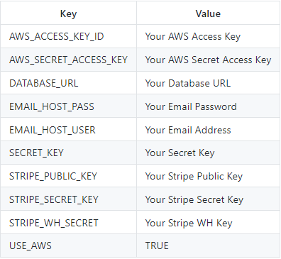
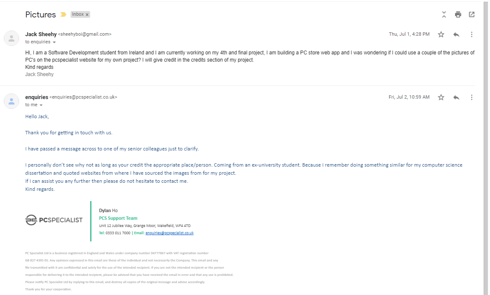

# Milestone Project 4 - PCme
View live project <a href="">here
***
## Table of Contents
* [User Experience](#user-experience)
   * [User Stories](#user-stories)
   * [Design](#design)
       * [1. Colour Scheme](#colour-scheme)
       * [2. Font](#font)
       * [3. Logo](#logo)
       * [4. Composition](#composition)
       * [5. Wireframes](#wireframes)
* [Technologies Used](#technologies-used)
* [Features](#features)
   * [Existing Features](#existing-features)
   * [Future Features](#future-features)
* [Testing](#testing)
* [Deployment](#deployment)
    * [Host on Github Pages](#host-on-github-pages)
    * [Running Project Locally](#run-your-project-locally)
* [Credits](#credits)
    * [Content](#content)
    * [Code](#code)
    * [Media](#media)
* [Acknowledgements](#acknowledgements)
***

***
## **What does it do and what does it need to fulfill?**


## **User Experience**

An eCommerce site selling Gaming and Workstation computers

## User Stories:

* All Users:
    * As a user, I want to be able to navigate through the entire site, comfortably and securely.
    * I would like to be able to view individual product details, so that I can confirm whether the product is suitable
    * I would like to be able to sort the items by price, product name, and product category, so that I can quickly identify products that I am interested in.
    * I would like to easily be able to view my search results, so that I can quickly identify products that I am interested in.
    * I would like to be able to register for an account, so that I can view past orders, and view and update my billing details.
    * I would like to be able to make a secure payment when I place an order.
    * I would like to receive feedback about whether or not my order was successful.
    * I would like to receive an email confirmation once I have placed an order.
    
* Registered Users:
    * I would like to be able to login to the site so that I can view/update my profile.
    * I would like to be able to easily log in/out of the site.
    * I would like to be able to update my delivery details

* Siteowner Goals:
    * I would like to be able to add products to the site, so that I can upload new products as they become available.
    * I would like to be able to edit products that are already on the site
    * I would like to be able to delete products from the site if need be.

* First Time Visitor Goals
    * I would like to browse the site and make a purchase
    * I would like to create an account
    * I would like to fiter between the products

* Returning Visitor Goals:
    * I would like to be able to view my profile
    * I would like my account details to be saved
    * I would like my shopping cart to save its contents for next time
  

[Back to Top](#table-of-contents)

#### Design
##### Colour Scheme

I chose colors that would be soothing and calming on first glance of the website, and not intrusive. The muted tones give the page a serene look
and feel. This was important to me as my aim was to create an online space that promotes and represents a feeling of what colours can be pleasent for the user to look at.

Colours I used are:
* A9A9A9 - Dark Gray - Primary Color
* bbbdf2 - Yellow (bootstrap - warning) - text and button Colour


The primary colour, Dark Grey (A9A9A9), was used throughout the pages to give the whole site consistency. I found that it gives the page a nicer
overall feeling and makes the text less harsh on the eye and therefoere easier to read.
<br>
The secondary color, Yellow (FFFF00), was used for the Navbar and the footer. I felt as if this was an appropriate color as it fits nicely with the colors from the festival hero images.


### Font

I decided to use 2 fonts throught my site. I included these fonts by inserting an _import_ link of Google Fonts API into the top of my html documents<br>
The font I chose for the body text on the pages was 'Quicksand', with a fall back of 'Sans-serif' should the site not load the import correctly. I
found the 'Quicksand' font was clear, easy to read and fed into the simple, minimal look and feel I was trying to achieve with the site.
 Clarity was important throughout my project and I felt as though Quicksand was a safe, reliable font to use.
When it came to font weight, I used to stock font weight for most of the page except the titles , I used the 'large' font size.

### Favicon

The favicoc was created using an online design tool called Free Logo Design. I created a custom canvas to fit my required dimensions and set the background to
be transparent as I was using a transparent navbar. when it came to designing the logo I typically like a plain yet attrctive logo so I used a simple "PCme" text in the color dark green.
### Composition

There is a clear structure throughout the site. Each of the main pages has a hero image at the top with some text to engage the user. I also implemented content
hinting on all the pages to encourage scrolling and more user interaction. 
To help me keep the design neat and consistent, I had all content displayed central, with good margins for desktop use to avoid anything being cut
off the screen. I ensured all the content is full width for mobile sizes, utilising all of the space available.

###  Wireframes

Wireframes for this project were created using Figma. I did enjoy the wireframing part of this project because that is where I can 
see if something will work or not on the site.
The final pages I ended up with are very different because halfway through development I decided to change my project completely, which was a terrible idea because that left me with no time to code.


 ## **Technologies Used**

 ### Languages

 * [HTML5](https://en.wikipedia.org/wiki/HTML5) - Language used to create the structure of the pages.

 * [CSS3](https://en.wikipedia.org/wiki/Cascading_Style_Sheets) - Language used to add styling across all pages.

 * [JavaScript](https://en.wikipedia.org/wiki/JavaScript) - Language used to create interactivity across the pages.

 * [Python](https://www.python.org/) - Language used to create the forms, views and urls for the site.


### Libraries, Frameworks and Editors

* [Django](https://www.djangoproject.com/) - Used as the main framework or the site.

* [Django Crispy Forms](https://django-crispy-forms.readthedocs.io/en/latest/) - Used to develop the forms on the site

* [Django Allauth](https://django-allauth.readthedocs.io/en/latest/decorators.html) - Used for user authentication across the site

* [Stripe](https://www.stripe.com/) - Used as the main payment processor for the site

* [Amazon Web Services](https://www.aws.com/) - S3 was used to store all static CSS and Javascript files, and images.

* [SQLite3](https://www.sqlite.org/index.html) - The database that was used in production

* [PostGres](https://www.postgresql.org/) -  is the database used by the deployed site.

* [jQuery](https://jquery.com/) - was used in conjunction with Bootstrap to create the navbar collapse element, opacity of the navbar on the scroll
of the page, and the modal pop up on submission of the contact form.
* [Heroku](https://heroku.com) - The host for the PCme site

* [Bootstrap 4](https://getbootstrap.com/) - used to create basic HTML layout and structure and using Bootstrap's CSS Framwework. The
resposnsive grid system was utilised well.

* [Google Fonts](https://fonts.google.com/) - was used to import the 'Quicksand' and 'Sans Serif' fonts, that were used across all pages.

* [Font Awesome](https://fontawesome.com/) - was used for the social icons and the calender link found in the footer.


* [EmailJS](https://www.emailjs.com/) - was used to send an email from JavaScript to my Gmail account.

* [Favicon.io](https://favicon.io/) - was used to generate the favicon image.

* [Git](https://git-scm.com/) - used for version control by making use of the Gitpod terminal to add, commit and push to Github.

* [Github](https://github.com) - used to host the project's repository and store the code, as well as host the website on Github pages.

* [Google Images](https://google.com) - used to find images for use across the site.

[Back to Top](#table-of-contents)
### Tools

* [Google](https://www.google.com/) - was used for researching various techniques, styles and information.

* [Google Chrome DevTools](https://developers.google.com/web/tools/chrome-devtools) - used for testing and debugging.
* [Figma](https://www.figma.com/) - used for creating the wireframes in the design stage.


* [Free Logo Design](https://www.freelogodesign.org/) - was used to design and create the logo, create the favicon logo, and also to resize images to specific dimensions.

* [Am I Responsive](http://ami.responsivedesign.is/) - used for showing the responsiveness of the site across different screen sizes and providing
the image at the top of this document.

* [Free Online HTML Formatter](https://www.freeformatter.com/html-formatter.html#ad-output) - used to format the HTML code in a neater and more
organised fashion.

* [Free Online CSS Formatter](https://www.freeformatter.com/css-beautifier.html) - used to format the CSS code in a neater and more organised
fashion.

* [Free Online JS Formatter](https://www.freeformatter.com/javascript-beautifier.html) - used to format the JavaScript code in a neater and more
organised fashion.

* [Free Online Python Formatter](https://www.tutorialspoint.com/online_python_formatter.htm) - used to format the Python code in a neater and more
organised fashion.

## **Features**

#### Existing Features

* Navbar - Featured across all pages. Site visitors can use the links on the on the navbar to navigate to home, PC's create account, login and signout.

* Hamburger Menu - A hamburger menu appears on smaller devices such as phones and tablets whch drops down the navbar items.

* Hero images -  This can be found on the home page. That image is off of [Google Images](https://images.google.com)

* Home Page - This page showcases  the hero image and a simple title stating "find the pc for your needs".

* Products Page - This page consists of the Gaming and Workstation PC's, in a row of 4. The user can then click on the desired PC which leads them to the products detail page. The products detail page gives the list of pc specs along with the price, rating and the option to add to the cart. I got the images for the PC' off of a website called PC Specialist, with the permission of the staff at PC Specialists I was allowed to use their images for my project. The user can sort between category, price, rating and A-Z in the dropdown sort menu.

* When a user adds something to the cart or they edit, delete something a toast will appear at the top right of the screen telling them what they have
done etc.

* There is a shopping cart icon next to the user profile icon, this indicates the total of the cart at any time.

* There is a search bar on the right side of the navbar also which the user can use to enter a query.

* Back-to-Top Button - Each page contains a back-to-top button that will appear when the user scrolls to a set pixel height down the page, giving
the user easier navigation around the pages and the site, this adds a nice bit of fluidity across the pages 

* Favicon Icon - When the user loads the web pages, a favicon image of "PC" is there in the browser bar. This is a simple logo and nothing extreme, it is simple.
 
 [Back to Top](#table-of-contents)
#### Future Features

* Review Page - A seperate page regarding the reviews of PC's and orders from verified customers.

* An About Us PAge and Integrate a Google Map API to showcase where the PCme office is located.

* I would like to have the opportunity to add more products than just PC's, maybe PC components and displays.

* I would like to have a newsletter also, where the user can register through the site.

* My favorite future feature would be integrating Google Pay to the site, as I am very fond of it myself as I use it in my day to day life.

[Back to Top](#table-of-contents)

## **Testing**

I had a severe lack of testing during my MS4, which I do regret now in the later stage.
Info about my testing as follows:

Knows Bugs and Fixes:
* When I was integrating my Stripe WH key, I gave the wrong URL in the Stripe WH Endpoint section which would lead to an Error 403.
To fix it I put the link as <br>
://black-hawk-faqpfcy4.ws-eu11.gitpod.io/checkout/wh/ <br> prior to that I forgot the chekout/wh/ at the end.
This is the error that it lead to - 
[Error Snapshot](media/img1.png)

* When trying to sign in to my account, I got the following error [Error Snapshot](media/img2.png),
which lead me to realise that I had 2 accounts with the same email, so to deal with that I deleted all accounts except the superuser and started again.

[Back to Top](#table-of-contents)

### **Validating The Code:**
- **HTML** I validated the HTML with the [W3C Markup Validation Service](https://validator.w3.org/)
- **CSS** I validated the CSS with the [W3C CSS Validation Service](https://jigsaw.w3.org/css-validator/)
- **JavaScript** I validated the JavaScript with the [Esprima Syntax Validator](https://esprima.org/demo/validate.html)
- **Python** I validated the Python code with the [Free Online Python Formatter](https://www.tutorialspoint.com/online_python_formatter.htm)

### **Validation Results**
#### **HTML**
- Home Page - No Errors Found
- Dingle Page - No Errors Found
- Contact Page - No Errors Found

#### **CSS**
- No Errors Found

[Back to Top](#table-of-contents)
 
#### **JavaScript**
#### **main.js file**
- No Errors Found
#### **maps.js file**
- No Errors Found
### **Python**
- No errors found, except in my checkout/views.py - 
I had a type where the else: statement was typed as esle: which caused an error where the checkout would not load.

```
 else:
        cart = request.session.get('cart', {})
        if not cart:
            messages.error(request, "There's nothing in your cart at the moment")
            return redirect(reverse('products'))
```

## **Testing on Different Browsers**
I manually tested the website on the following browsers:
- Chrome
- Safari
- Mozilla Firefox
- Samsung Internet

### **Testing responsiveness on multiple devices and screen size:**
I manually tested the website using Chrome Developer Tools to check every single page, link etc. on as much different devices as possible.
The devices I tested this on were: Moto G4 , Galaxy S5 , Pixel 2 and Pixel 2 XL, iPhone 6/7/8, iPhone 6/7/8Plus, iPhone X, iPad.
I also tested my website on my own persoanl devices: MacBook Pro 16", my desktop pc with a 49" ultrawide-monitor, Samsung Galaxy S20 Ultra and a Samsung Galaxy Tab S7+.


## **Issues Found**

- the one major issue I came across was on my MacBook , the mesage toasts would appear to the left side of the screen rather than the right, I fixed that with a simple "float right" class in the div container.


## **Deployment**
This project was developed in GitPod and deployed to the hosting platform [GitHub Pages](https://pages.github.com/)

### Heroku Deployment with AWS:

1. Install gunicorn, psycopg2-binary and dj-database-url using the PIP3 Install command.
2. Freeze all the requirements for the project into a requirements.txt file using the pip3 freeze > requirements.txt command.
3. Create a procfile, with the following inside it: web: gunicorn pc-me.wsgi:application.
4. Push these changes to GitHub, using git add ., git commit -m and git push commands.
5. Navigate to Heroku, and login or create an account.
6. Once logged in, click on 'resources'.
7. From the add-ons search bar, add the Heroku Postgres DB, select the free account, and then submit order form to add it to the project.
8. From the app's dashboard, click on 'settings', and then 'reveal config vars' in order to set the necessary configuration variables for the project. It should look like this:

9. Back on the main dashboard, click on 'deploy', and then under the 'Deployment' method section, select GitHub and 'Automatic Deploys'.
10. Ensure that in settings.py, the following code is commented out:

``` 
Database https://docs.djangoproject.com/en/3.1/ref/settings/#databases 

```
 make sure to add the following code :

 ``` 
 DATABASES = {'default': dj_database_url.parse(os.environ.get('DATABASE_URL'))} 
 
  ```

11. Make migrations using the following command:
```
python3 manage.py makemigrations
```

and migrate the database models to the Postgres database using the following command:
```
python3 manage.py migrate
```

12. Load the fixtures from the 'product_types.json' file and then from the 'products.json' file - which are contained in the 'fixtures' folder into the database. This is done by using the following command:
```
python3 manage.py loaddata <file name>
```

13. Create a new superuser:
```
python3 manage.py createsuperuser
```

14. Disable COLLECT_STATIC with the following code: 
```
heroku config:set DISABLE_COLLECTSTATIC=1 
```

15. Add to settings.py the following code:
```
ALLOWED_HOSTS = ['pcme-store.herokuapp.com', 'localhost']
```

16. Add Stripe environment variables to settings.py 
```
STRIPE_PUBLIC_KEY = os.getenv('STRIPE_PUBLIC_KEY', '')
STRIPE_SECRET_KEY = os.getenv('STRIPE_SECRET_KEY', '')
STRIPE_WH_SECRET = os.getenv('STRIPE_WH_SECRET', '')
```

17. Push to heroku using the command:
```
git push heroku master
```


### Amazon Web Services
All Static and media files for the deployed version of the site are hosted in a Amazon Web Services(AWS) S3 bucket

1. In the gitpod terminal, install boto3 and django-storages using the following commands: 
```
pip3 install boto3 
```
```
pip3 install django-storages
```

2. Freeze the new requirements into the 'requirements.txt' file using:
```
pip3 freeze > requirements.txt
```

3. Add 'storages' to INSTALLED_APPS in settings.py
4. Add the following code to settings.py in order to link the Amazon Web Services bucket to the site:
```
if 'USE_AWS' in os.environ:
    # Cache control
    AWS_S3_OBJECT_PARAMETERS = {
        'Expires': 'Thu, 31 Dec 2099 20:00:00 GMT',
        'CacheControl': 'max-age=94608000',
    }

    # Bucket Config
    AWS_STORAGE_BUCKET_NAME = 'pcme-store'
    AWS_S3_REGION_NAME = 'eu-west-2'
    AWS_ACCESS_KEY_ID = os.environ.get('AWS_ACCESS_KEY_ID')
    AWS_SECRET_ACCESS_KEY = os.environ.get('AWS_SECRET_ACCESS_KEY')
    AWS_S3_CUSTOM_DOMAIN = f'{AWS_STORAGE_BUCKET_NAME}.s3.amazonaws.com'

    # Static and media files
    STATICFILES_STORAGE = 'custom_storages.StaticStorage'
    STATICFILES_LOCATION = 'static'
    DEFAULT_FILE_STORAGE = 'custom_storages.MediaStorage'
    MEDIAFILES_LOCATION = 'media'

    # Override static and media URLs in production
    STATIC_URL = f'https://{AWS_S3_CUSTOM_DOMAIN}/{STATICFILES_LOCATION}/'
    MEDIA_URL = f'https://{AWS_S3_CUSTOM_DOMAIN}/{MEDIAFILES_LOCATION}/'
```

5. Create a custom_storages.py file in the root level of the project. Inside it, include the locations of the Static Storage and Media Storage. 
6. Delete DISABLE_COLLECTSTATIC from the Heroku Config Variables.
7. Push to GitHub, and all changes should be automatically pushed to Heroku too. Set debug=False.

#### Making a Local Clone

In order to make a local clone of PCme website, enter
```
git clone https://github.com/jacksheehy15/pcme-project.git 
```
into the terminal.

Create an env.py file in the root directory of the project and add it to the .gitignore file.
The following code has to be added to the env.py file.
```
import os  
os.environ["DEVELOPMENT"] = "True"    
os.environ["SECRET_KEY"] = "<Your Secret Key>"
os.environ["STRIPE_PUBLIC_KEY"] = "<Your Stripe Public Key>"    
os.environ["STRIPE_SECRET_KEY"] = "<Your Stripe Secret Key>"    
os.environ["STRIPE_WH_SECRET"] = "<Your Stripe WH Secret Key>"   

```

Then make sure that the required packages are installed by running the following command: 
```
pip install -r requirements.txt
```

Make migrations and then migrate in order to create a database, by running the following commands: 
```
python3 manage.py makemigrations and python3 manage.py migrate
```

Load the fixtures from the 'product_types.json' file and then from the 'products.json' file - which are contained in the 'fixtures' folder into the database. This is done by using the following command:
```
  python3 manage.py loaddata <file name> 
```

Create a superuser with the following command:
```
python3 manage.py createsuperuser
```
and enter your credentials

Run the site by entering the following command:
```
python3 manage.py runserver
```

[Back to Top](#table-of-contents)

## **Credits**

#### Content

All content on the website was written by me, the developer, with inspiration taken from other websites. 
A list of the websites I used for the links on my webpage below :

* [Pc Specialist ](https://www.pcspecialist.ie/) - For the PC images
* [MDBootstrap](https://www.mdbootstrap.com/) - For some guidleines for Bootstrap
* [Boutique Ado](https://github.com/Code-Institute-Solutions/boutique_ado_v1) - For backup and help for my project.
Much of this project was copied and adapted from the Code Institute 'Boutique Ado' project.
* [Stack Overflow](https://stackoverflow.com) - Was a massive help in debugging my code.


#### Media

The images used on the website were taken from PC Specialist site.
Here is an image stating I got permission to use these images.

 

The logo image was created and exported to my computer using the site [Free Logo Design ](https://www.freelogodesign.org/)

The favicon image was created and exported to my computer using the site [Free Logo Design](https://www.freelogodesign.org/), and then uploaded to the site [Favicon.io]
(https://favicon.io/) to be generated as an ico image, to then be exported back to my computer and then added to my root directory on gitpod.


[Back to Top](#table-of-contents)
## **Acknowledgements**


#### Pages used for information

* [Stack overflow](https://stackoverflow.com/)

* [W3schools](https://www.w3schools.com/)

* [Code Institute](https://codeinstitute.net/)

* [Code Institute Sample README](https://github.com/Code-Institute-Solutions/SampleREADME)

* [Slack](https://slack.com/intl/en-gb/)

* [YouTube](https://www.youtube.com/)

[Back to Top](#table-of-contents)

#### Special thanks

*  Antonio Rodriguez my mentor, for the support and guidance he gave thoughout the build of this project and for taking my calls when needed.

* Tutor Support at Code Institute for really helping me with the issues I had, especially Sean, he drastically helped me.

I would like to especially thank Neil from Code Institue student care for giving me a slight deadline extension.
If you so happen to read this, I am forever grateful for that chat.

* Code Institute for the informative lessons and teachings they provided.

[Back to Top](#table-of-contents)

##### Side Note
- I know there is quite a lack of testing, and quite a lack of my own personal touch but this project was extremeely challenging mentally and psysicaly. Imposter Syndrome got the better of me most days which is not ideal but I still managed to get it done. 


## Disclaimer

This project was created for educational use only. It has been part of studying at the Code Institute as part of their Full Stack Software Developer
Course.